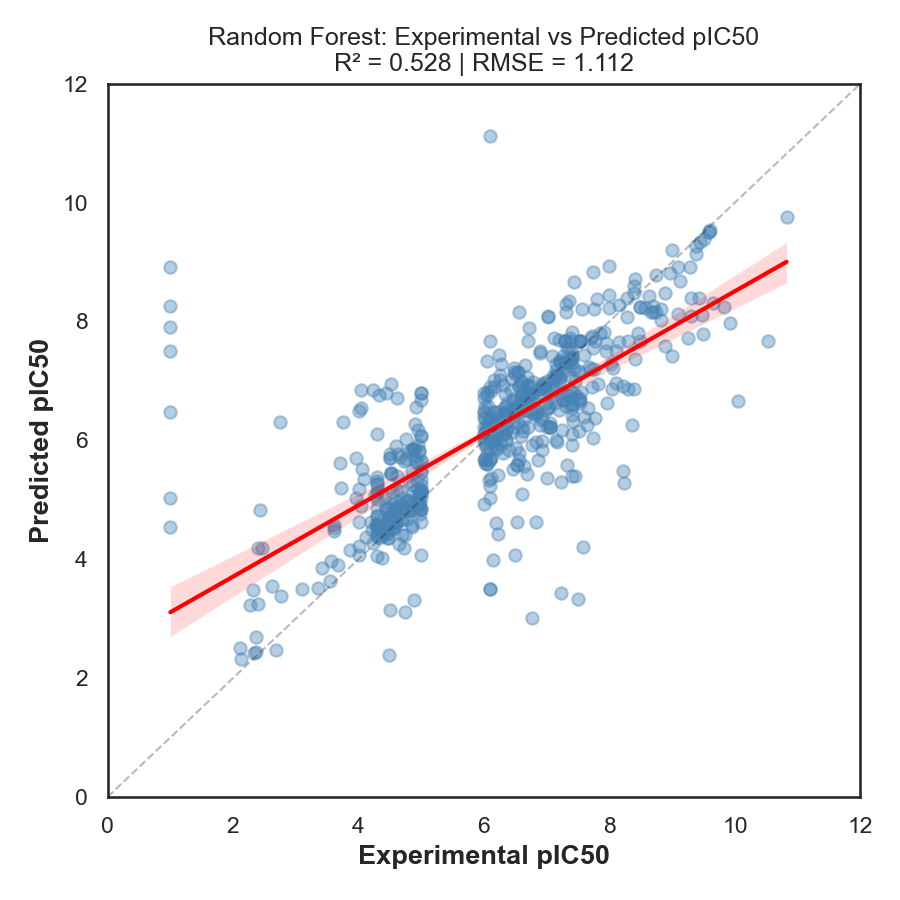
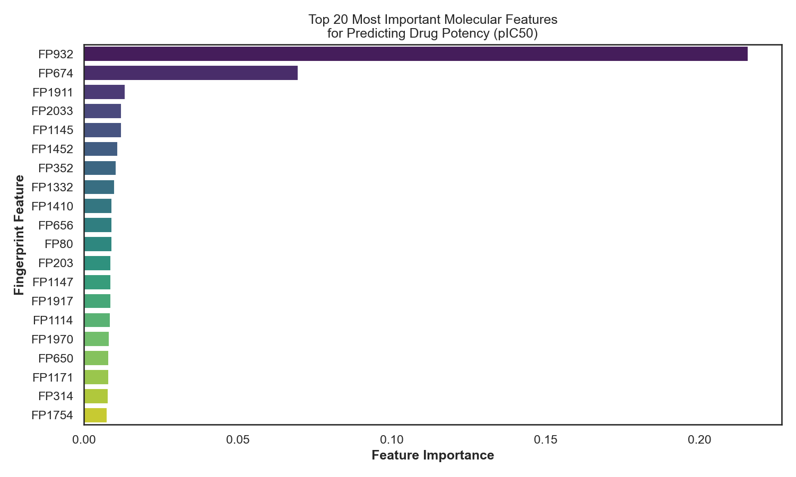

# Computational Drug Discovery using Machine Learning

This project is about building a simple drug discovery pipeline using ChEMBL bioactivity data to predict pIC50 values for aromatase inhibitors. First I cleaned the dataset and calculated basic molecular descriptors like molecular weight, LogP and hydrogen bond features, then converted SMILES into Morgan fingerprints so machine learning model can understand chemical structures.

After that I processed the data by converting IC50 into pIC50 and removed invalid or infinite values, also applied variance threshold to remove useless features. Then I trained a Random Forest model and also tested another model for better performance. The model gives decent prediction results and shows how molecular features affect drug potency.

This project basically shows full workflow from raw bioactivity data to machine learning prediction which is used in real drug discovery. It includes data processing, feature engineering, model building and evaluation.

Tech used: Python, RDKit, scikit-learn, pandas, numpy, matplotlib.

Author: AHMED ASID

Results

Author: AHMED ASID
